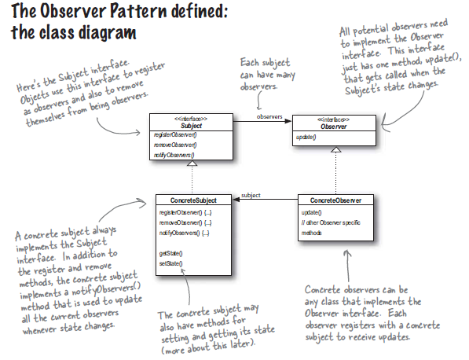

## Chapter 2: Observer Design pattern, Keeping your objects in the know

- **Category:** Behavioral 
- **Also known as:** Event-subscriber, Listner 

A behavioral design pattern that let's you define a subscription mechanism to notify multiple objects about any events that happen to the object they're observing. 

Subject object manages some bits of data. 
The observers have subscribed to (registered with) the Subject to recieve updates when the Subject data changes. 
When data in the Subject changes, the Observers are notified. 
New data values are communicated to the observers in some form when they change. 

### A day in the life of the observer pattern
The subject holds an int value. 
The list of observers include: Dog object, Mouse object and Cat object. 
1- A duck object comes along and tells the Subject that it wants to become an observer. 
2- The subject gets a new value. All the observers are notified along with the new value communicated to them. 
3- The Mouse object asks to be removed. 
4- The subject has a new int value, observers are notified except the Mouse object. 

### The observer pattern defined
When you're trying to picture the Observer pattern, a newspaper subscription service with its publisher and subscribers is a good way to visualize the pattern. 
The conceptual definition howerver is as like this: **The Observer Pattern** defines a **One-To-Many** dependency between objects, so when one object changes state all of it's dependents are notified and updated automatically. Depending on the style of the notification the observer may also be updated with new values.

### The class diagram

- Objects use the Subject interface to register/remove themselves as Observers. 
- All potential Observers need to implement the Observer interface. This interface has just one method: `update()` that gets called when the Subject's state change. 
- A one-to-many relationship links the Subject interface to the Observer interface; Meaning the Subject has one to many Observers attached to it. 
- A concrete Subject always implements the Subject interface. The concrete Subject implements a method called `notifyObservers()` used to updated all the concrete Observers
when ever the sate changes. 
- The concrete Subject may also have methods for setting and getting it's state. 
- Concrete observers can be any class that implements the Observer interface. Each observer registers with a concrete subject to recieve updates. 

**notes** 
- With the observer pattern the subject is the object that contains the state and controls it. 
- There are **ONE** subject object and **MANY** observer objects that rely on the subject the notify them about the state changes. 
- Because the subject isthe sole owner of the data the observers are dependent on it to get updated when the data changes. This leads to a cleaner OO design than allowing
many objects to control the same data.

### The power of loose coupling
**when two objects are loosely coupled, they can interact, but have very little knowledge of each other. The Observer pattern provides an object design where subjects
and observers are loosly coupled. This loose coupeling is achieved through the use of iterfaces and composition.**

- **The only thing the subject knows about an observer is that it implements a certain interface.** It doesn't need know whtat the observer class is or what it does. 
- **We can add new observers at any time.** Because the only thing the subject objects depends on is a list of objects that implements the observer interface. 
- **We'll never need to modify the subject to add new observers.** All we have to do is implement the observer interface and register as an observer. 
- **We can reuse subjects or obesrvers independently of each other.** Changes to subject or observers wont have an effect on one or the other. 

**Loosely coupled designs allow us to build flexible OO systems that can handle change because they minimize the interdependency between objects.** 

### Bullet points
- The observer pattern defines a one-to-many relationship between objects. 
- Subjects, also called Observables, update observers using a common interface. 
- Observers are loosely coupled in that the oberservable knows nothing about them, other then they implement the observer interface. 
- **JAVA** has several implementations of the observer pattern, including the general purpose java.util.Observable. 

### Online ressources
- https://refactoring.guru/design-patterns/observer
- https://en.wikipedia.org/wiki/Observer_pattern
